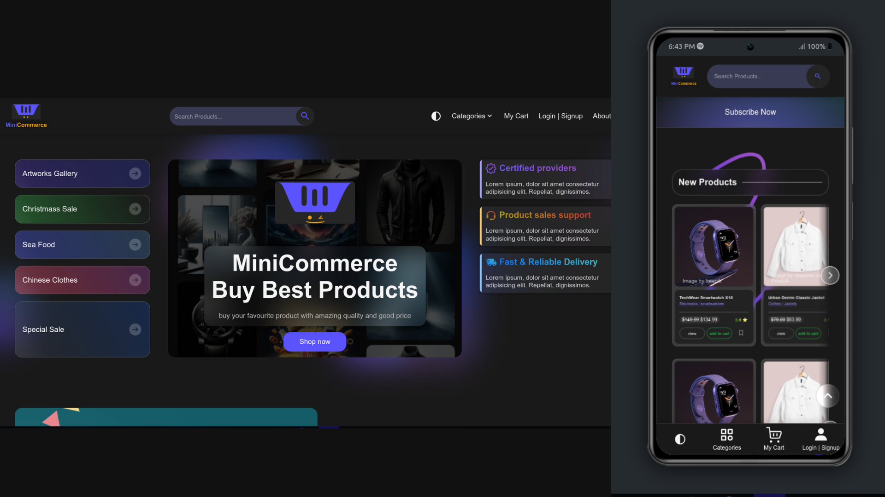
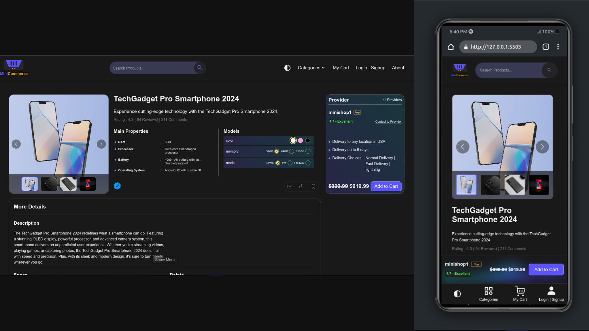
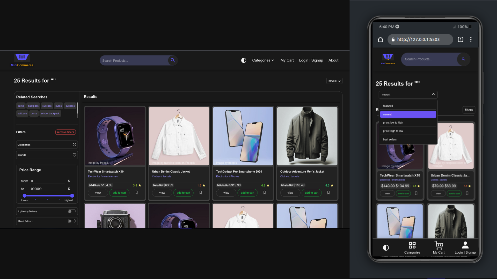
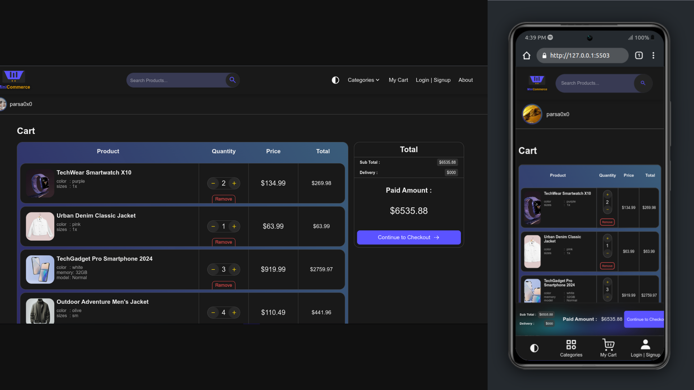
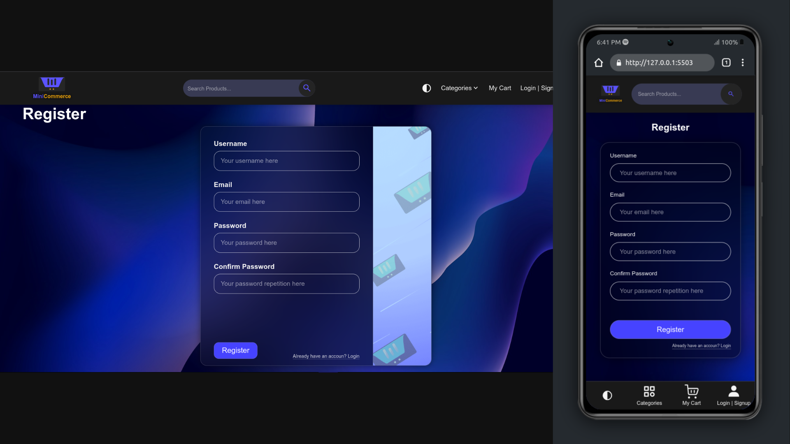

# MiniCommerce - E-Commerce website

## live preview

### Access to each page
- landing page: click on the main logo on the top-navbar
- product page: click on a product

- search-products page: click on the search-logo(magnifier) on the top-navbar

- cart page: click on the 'My Cart' link on the top-navbar

- register page: : click on the 'Login|Signup' link on the top-navbar

## Overview

This ecommerce website project aims to provide a user-friendly, responsive, and accessible platform for selling products. The website features a modern design, dynamic product pages, a shopping cart, and various user-friendly functionalities. The project utilizes HTML, CSS, and JavaScript to create an engaging and efficient shopping experience. ( this project is focused on markup-writing & styling (Semantic HTML, Markup Best Practices, Accessibility, Responsiveness, Animations, Styling Abilities, ...), and some functionalities will be implemented soon ). for now I implemented 4 of most important pages of an e-Commerce: landing page, product page, search-products page, cart page, register page (other pages will be made soon)

## Technologies Used

### Languages
- **HTML5**
- **CSS**
- **JavaScript**
- **noUiSlider** (library used for a range slider in the product search page)

### APIs
- **Fetch API:** Used to load products, comments, and other data.
- **Intersection Observer API:** Used to control appearance animations of elements.

## Key Features

- **User-friendly UI**
- **Ability to Change Dark/light themes**
- **Responsive Design** for mobiles, tablets, desktops, and extra-large screens
- **Responsive Images** with quality adjustment based on user device size
- **Dynamic product data fetching** from JSON files using JavaScript
- **Product comments fetching** from JSON files using JavaScript
- **Product information fetching** from JSON files using JavaScript
- **CSS animations controlled by JavaScript**
- **Intersection Observer for scroll-based animations**
- **Relative font sizes for better accessibility**

## Different pages features:

### Landing Page

- **Modern CSS-Techniques to style the Page**
- **Animated Elements in Appearance**: animated elements using 'pure CSS & JS', when user reaches the elements, they will come-in with smooth animations
- **Animated Elemnets on hover**: Used CSS to animate elements when user hovers on them
- **Closing/Opening Top-Navbar Menu by hovering**
- **Top-Navbar appearance is different and Responsive on tablet/mobile**
- **Products Showcase Carousel-Slider**: with autoplay and slide buttons (pure CSS + JS)
- **Responsive Products-row by CSS-Grid**: Products-rows are fully 'dynamic(by fetch)' & 'Responseve'
- **Product rows with navigation-buttons**: the products-rows provide a smooth-transition when user navigates to left/right in the row, to see all products (pure CSS + JS)
- **Beautifully Designed/Implemented Contact form & FAQs accordion**: pure CSS + JS

### Product Page

- **Detailed product information** : all Product-info like: name, price, price after discount, models, colors, sizes, images(which is set to images-carousel), description(long & short), points, details, .... are get from 'products-data.json' dynamically, and the page-content is generated/manipulated by 'pure JS'
- **User-friendly product image slider**: an 'image carousel-slider' is dynamically made (based on products-data.json -> images field), by pure JS, with ability to :
   1. Navigate to previous/next image
   2. Magnifying the image on the page, by hovering on image (like Amazone website)
   3. Focus on image(on a modal-page) by clicking on the image

- **Ability to change product models**: each Product has a 'models' area (made dynamically using .json file) , that user can select desired model/color/size,... of the product (pure CSS + JS)
- **Providers information**: each product-page, has 2 providers area: one for current-page's provider (with its price), and one for 'other providers' of the same product (generated from .json file by pure JS)
- **Comments section with commenting form**: also comments of each product is generated dynamically by pure JS, from 'comments-data.json' file by (Fetch API). and also there is a commenting-form in the 'comments' section, which user can write his/her comment below the product(for now the ability to write comments & append them are unavailable, but will be implemented soon)
- **Related products row**: a row of 'related products' is generated dynamically created from 'related-products-data.json' file, by Fetch API + JS

## Product-Search Page
- **Dynamic products-fetching**: fetching the products dynamically by Fetch API + JS from 'all-products-data.json' file
- **Responsive products grid**: Responsive layout for mobile/desktop,..
- **searching filters/controllers**: a set of filters/controllers is made for advanced searching:
  related results
  filters(categories, brands, ...)
  price range-slider
  delivery options
- **Custom input/labels UI**: all of inputs/labels(checkboxes, radio-buttons,...) are made by pure CSS + JS (without any UI-library)
- NOTE: the searching mechanism is not implemented yet (because we need backend APIs), but will be implemented soon

## Cart Page
- **Dynamically Fetching user-cart Products**: dynamically fetches user's cart products from 'cart-products-data.json' file(like getting from DB)
- **Semantic & Accessible Table of Products**: the table of products is implemented by semantic-elements, and Accessibility attributes/principles
- **Modern Styling of Cart by CSS**
- **Ability to decrease/increase the product count**: User can increase/decrase the count of each product in table
- **Ability to remove the Product from Cart**: User can remove each product from cart
- **Live Price-Calculation**: after the first load og the page, the total-price of products is calculated and is shown in the page, also by each increasing/decreaseng/removing of products, the total-price will be calculated again on the page
- **Calculating total-prices Separately**: when user changes the number of a product, its total-price (in the table) is also changed in real-time

## Register Page
- **Semantic Inputs For Each Field**
- **Responsive for all devices**

## HTML Considerations

- **Semantic HTML** principles observed
- **Schema.org attributes** used
- **Accessibility principles** applied
- **SEO principles** followed

## CSS Features

- **Flexbox** for layout
- **Grid** for layouts in landing page and other sections
- **CSS animations** for landing page elements with JavaScript control
- **Custom-styled checkboxes** in product page for model selection
- **CSS gradients** for shadow effects in product rows and popular products section

## JavaScript Skills

- **Fetch API** for fetching product, comment, and other data
- **Asynchronous programming** for handling fetched data
- **Intersection Observer** for handling appearance animations of elements

## Optimization Techniques

- **Optimizing CSS animations**
- **Minifying and making images responsive**
- **Debouncing or throttling scroll event listeners**
- **Batching DOM queries**
- **Simplifying logic and reducing function calls**
- **Reducing animation complexity**
- **Implementing lazy loading**

## Accessibility

In this project I used various Accsessibility techniques to provide a usable website for everyone, such as: WAI-ARIA attributes/roles, tab-navigation, contrast, ....

## Credits

- Graphical posters and personal logos created by Parsa Farahani
- Regular icons from free resources like [Iconify Design](https://iconify.design/) and [Google Fonts Icons](https://fonts.google.com/icons)
- Other resources which are used from external sources, are attributed (by a small link below the image)